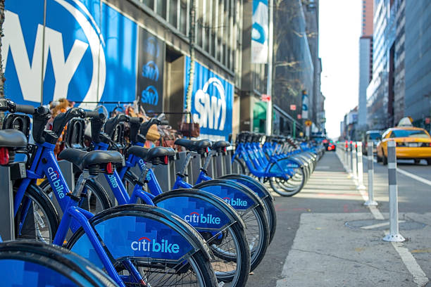
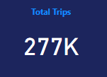
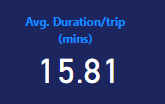
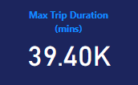
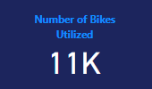
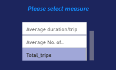
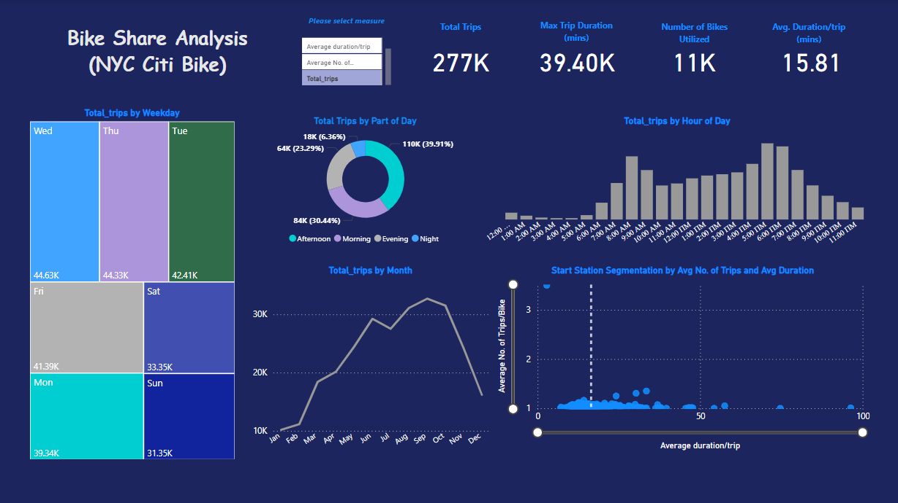

# NYC CitiBike Trip Analysis (Using PowerBI)

## Introduction

I came across the dataset online and admired how rich the data it is, being that I have been trying to get my hands on a good dataset that would serve as a platform to highlight some of my PowerBI skills
This is a power BI project on BikeShare Analysis-NYC Citi Bike showing trips for the year 2016. The project is to analyze and drive insights to answer questions and help the industry make data driven decisions.

## Problem Statement

#### Trip Frequency and Patterns
1. What are the peak hours for bike?
2. How does the number of trips vary by day of the week?
3. How does the number of trips vary by month over the year?

#### Trip Time Analysis
What is the average duration of trips, and how does it vary by day or time?

#### Categorization/Segmentation of Start Station
How can we group the start up stations in terms of average duration per trip and average number of trips per bike, and subsequently drive overall usage/revenue for the business.

## Skills/Concepts demonstrated

The following Power BI features were incorporated:

- DAX
- Measures
- New Column creation
- Date/Time functions
- Dynamic functionality
- Switch measures
- Button

## Data Sourcing

Data was gotten from kaggle, click link (https://www.kaggle.com/datasets/samratp/bikeshare-analysis?select=NYC-CitiBike-2016.csv) to view data.

## Data Modelling

No data modelling was done since the analysis was done using just 1 table.

## Data Transformation

Some of the important transformation steps are highlighted here

### Steps followed 

- Step 1 : Load data into Power BI Desktop, dataset is a csv file (NYC-CitiBike-2016)
- Step 2 : Open power query editor & in view tab under Data preview section, check "column distribution", "column quality" & "column profile" options.
- Step 3 : Also since by default, profile will be opened only for 1000 rows so you need to select "column profiling based on entire dataset".
- Step 4 : It was observed that in none of the columns errors & empty values were present.
- Step 5 : Create new time specific columns on the dataset

          i)   WEEKTYPE = IF(WEEKDAY([starttime])=1,"Weekend",IF(WEEKDAY([starttime])=7,"Weekend","Weekday"))
  
          ii)  WEEKDAY = FORMAT([starttime],"ddd")
  
          iii) MONTHNUMBER = MONTH([starttime])
  
          iv)  HOUR_OF_DAY = IF(HOUR([starttime])=0,"12:00 AM",
                             IF(HOUR([starttime])=1,"1:00 AM",
                             IF(HOUR([starttime])=2,"2:00 AM",
                             IF(HOUR([starttime])=3,"3:00 AM",
                             IF(HOUR([starttime])=4,"4:00 AM",
                             IF(HOUR([starttime])=5,"5:00 AM",
                             IF(HOUR([starttime])=6,"6:00 AM",
                             IF(HOUR([starttime])=7,"7:00 AM",
                             IF(HOUR([starttime])=8,"8:00 AM",
                             IF(HOUR([starttime])=9,"9:00 AM",
                             IF(HOUR([starttime])=10,"10:00 AM",
                             IF(HOUR([starttime])=11,"11:00 AM",
                             IF(HOUR([starttime])=12,"12:00 PM",
                             IF(HOUR([starttime])=13,"1:00 PM",
                             IF(HOUR([starttime])=14,"2:00 PM",
                             IF(HOUR([starttime])=15,"3:00 PM",
                             IF(HOUR([starttime])=16,"4:00 PM",
                             IF(HOUR([starttime])=17,"5:00 PM",
                             IF(HOUR([starttime])=18,"6:00 PM",
                             IF(HOUR([starttime])=19,"7:00 PM",
                             IF(HOUR([starttime])=20,"8:00 PM",
                             IF(HOUR([starttime])=21,"9:00 PM",
                             IF(HOUR([starttime])=22,"10:00 PM",
                             IF(HOUR([starttime])=23,"11:00 PM","Blank"))))))))))))))))))))))))

            v)  HOUR_ID = HOUR([starttime])

            vi) PARTS_OF_DAY = IF(HOUR([starttime])=0,"Night",
                               IF(HOUR([starttime])=1,"Night",
                               IF(HOUR([starttime])=2,"Night",
                               IF(HOUR([starttime])=3,"Night",
                               IF(HOUR([starttime])=4,"Night",
                               IF(HOUR([starttime])=5,"Night",
                               IF(HOUR([starttime])=6,"Morning",
                               IF(HOUR([starttime])=7,"Morning",
                               IF(HOUR([starttime])=8,"Morning",
                               IF(HOUR([starttime])=9,"Morning",
                               IF(HOUR([starttime])=10,"Morning",
                               IF(HOUR([starttime])=11,"Morning",
                               IF(HOUR([starttime])=12,"Afternoon",
                               IF(HOUR([starttime])=13,"Afternoon",
                               IF(HOUR([starttime])=14,"Afternoon",
                               IF(HOUR([starttime])=15,"Afternoon",
                               IF(HOUR([starttime])=16,"Afternoon",
                               IF(HOUR([starttime])=17,"Afternoon",
                               IF(HOUR([starttime])=18,"Evening",
                               IF(HOUR([starttime])=19,"Evening",
                               IF(HOUR([starttime])=20,"Evening",
                               IF(HOUR([starttime])=21,"Evening",
                               IF(HOUR([starttime])=22,"Night",
                               IF(HOUR([starttime])=23,"Night","Blank"))))))))))))))))))))))))

           vii)  Trip Duration_mins = 'NYC-CitiBike-2016'[tripduration_sec]/60

**Calculated columns created

- Step 6 : Create a new table called SlicerValues (This is what I will be using for my switch measures)

- Step 7 : DAX Calculations - Create a new table called Calculations; this is where all my new measures created would reside for better organization of my report
  
           i)   Total_trips = COUNTROWS('NYC-CitiBike-2016')
           ii)  Average duration/trip = DIVIDE(SUM('NYC-CitiBike-2016'[Trip Duration_mins]),COUNTROWS('NYC-CitiBike-2016'))
           iii) Max Trip Duration = MAX('NYC-CitiBike-2016'[Trip Duration_mins])
           iv)  Min Trip Duration = MIN('NYC-CitiBike-2016'[Trip Duration_mins])
           v)   # Bikes Utilized = DISTINCTCOUNT('NYC-CitiBike-2016'[bikeid])
           vi)  Average No. of Trips/Bike = DIVIDE('CALCULATIONS'[Total_trips],'CALCULATIONS'[# Bikes Utilized])

    |  |  |  |

- Step 8 : Now I created the switch measures

           SW_Measures = 
           VAR Selected_Value = SELECTEDVALUE('SlicerValues'[Value])
           VAR Result = SWITCH(Selected_Value,
                        "Total_trips",[Total_trips],
                        "Average duration/trip",[Average duration/trip],
                        "# Bikes Utilized",[# Bikes Utilized],
                        "Average No. of Trips/Bike",[Average No. of Trips/Bike],
                        BLANK()
           )
           RETURN
           Result

- Step 9 : Visualization begins

- Step 10: I created a measure to give each chart title an interactive feature, whereby each chart title changes according to the measure being selected on the swictch slicer

Columnchart Title = SELECTEDVALUE(SlicerValues[Value]) & " by Hour of Day"

Linechart Title = SELECTEDVALUE(SlicerValues[Value]) & " by Month"

Treemap Title = SELECTEDVALUE(SlicerValues[Value]) & " by Weekday"

Below is a screenshot of the report

